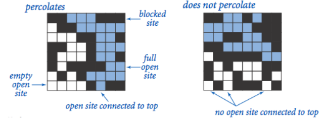

# 实验一：渗透问题

## 题目描述

使用合并-查找（union-find）数据结构，编写程序通过蒙特卡罗模拟（Monte Carlo simulation）来估计渗透阈值的值。

给定由随机分布的绝缘材料和金属材料构成的组合系统：金属材料占多大比例才能使组合系统成为电导体？ 给定一个表面有水的多孔渗水地形（或下面有油），水将在什么条件下能够通过底部排出（或油渗透到表面）？ 科学家们已经定义了一个称为渗透（*percolation*）的抽象过程来模拟这种情况。

-   模型：我们使用 *N×N* 网格点来模型一个渗透系统。 每个格点或是 *open* 格点或是 *blocked* 格点。 一个 *full site* 是一个 *open* 格点，它可以通过一连串的邻近（左，右，上，下）*open* 格点连通到顶行的一个 *open* 格点。如果在底行中有一个 *full  site* 格点，则称系统是渗透的。（对于绝缘/金属材料的例子，open格点对应于金属材料，渗透系统有一条从顶行到底行的金属路径，且 *full site* 格点导电。对于多孔物质示例，*open* 格点对应于空格，水可能流过，从而渗透系统使水充满 *open* 格点，自顶向下流动。）

    

-   问题：在一个著名的科学问题中，研究人员对以下问题感兴趣：如果将格点以空置概率 *p* 独立地设置为 *open* 格点（因此以概率 1-*p* 被设置为 *blocked* 格点），系统渗透的概率是多少？ 当 *p*=0 时，系统不会渗出；当 *p*=1 时，系统渗透。下图显示了 20×20 随机网格（左）和 100×100 随机网格（右）的格点空置概率 *p* 与渗滤概率。

    

    当 *N* 足够大时，存在阈值 $p^*$，使得当 *p* < $p^*$，随机 *N×N* 网格几乎不会渗透，并且当 *p* > $p^*$ 时，随机 *N×N* 网格几乎总是渗透。 尚未得出用于确定渗滤阈值 $p^*$的数学解。我们需要编写一个计算机程序来估计 $p^*$。

## 解决方法

-   构建 Percolation 类

    首先，在构造函数中，我们为 *N×N* 网格添加头尾各一个虚拟格点，编号分别为 0 和 N*N+1，并将其设置为 open。相关代码如下：

    ```java
    public Percolation(int N, int choice) {
            if (N <= 0) {
                throw new IllegalArgumentException("N must be greater than 0!");
            }
            this.N = N;
            if (choice == 1) {
                this.grid = new WeightedQuickUnionUF(N * N + 2);
            } else {
                this.grid = new QuickFindUF(N * N + 2);
            }
            status = new boolean[N * N + 2];
            status[0] = status[N * N + 1] = true;   // virtual top and bottom are open
    }
    ```

    对于open函数，每open一个格点，检查相邻4个方向，合并已经open的邻居格点。相关代码如下：

    ```java
    // open site (row, col) and connect it to its open neighbors
        public void open(int row, int col) {
            validate(row, col);
            int index = linearIndex(row, col);
            status[index] = true;
            count++;
    
            if (row == 1) {
                grid.union(0, index);
            }
            if (row == N) {
                grid.union(index, N * N + 1);
            }
            neighborConnect(row, col, row - 1, col);    // up
            neighborConnect(row, col, row + 1, col);    // down
            neighborConnect(row, col, row, col - 1);    // left
            neighborConnect(row, col, row, col + 1);    // right
    }
    
    // connect neighbor if it is open
        private void neighborConnect(int rowA, int colA, int rowB, int colB) {
            if (0 < rowB && rowB <= N && 0 < colB && colB <= N && isOpen(rowB, colB)) {
                grid.union(linearIndex(rowA, colA), linearIndex(rowB, colB));
            }
    }
    ```

    由于虚拟头尾格点的存在，判断 full 格点只需判断其与虚拟头格点是否连通，判断系统是否渗透只需判断虚拟头尾格点是否连通。

    ```java
    public boolean isFull(int row, int col) {
            validate(row, col);
            return grid.connected(0, linearIndex(row, col));
    }
    
    // the system percolates if virtual top is connected to virtual bottom
    public boolean percolates() {
            return grid.connected(0, N * N + 1);
    }
    ```

-   构建 PercolationStats 类

    -   本实验采用蒙特卡洛算法，模拟估计渗透阈值，具体步骤如下：

        -   初始化所有格点为 *blocked*；

        -   在所有的 *blocked* 格点中随机均匀选择一个格点 (row i, column j) 设置为 *open*，重复执行直至系统渗透；
        -   上述步骤重复进行 T 次，计算渗透阈值的平均值、标准差和 95% 置信区间。

    ```java
    public void test(int choice) {
            // Monte Carlo simulation
            for (int i = 0; i < T; i++) {
                long startTime = System.currentTimeMillis();
                Percolation percolation = new Percolation(N, choice);
                int openSites = 0;
                while (!percolation.percolates()) {
                    int row = StdRandom.uniform(N) + 1;
                    int col = StdRandom.uniform(N) + 1;
                    if (!percolation.isOpen(row, col)) {
                        percolation.open(row, col);
                        openSites++;
                    }
                }
                ratios[i] = (double) openSites / (N * N);
                long endTime = System.currentTimeMillis();
                runTimes[i] = (double) (endTime - startTime);
            }
            show(choice);
    }
    ```

    注：我们通过参数 choice 来选择不同的合并查找算法。0 对应 QuickFind 算法，1 对应 WeightedQuickUnion 算法。

## 实验结果

为了比较不同算法差异，我们选择 T=100，即每次进行 100 次实验模拟，逐渐增大 N 值，计算不同 N 值时算法的平均运行时间及渗透阈值的相关估计值(平均值、标准差和置信区间)。

```
========== N = 10, T = 100 ==========
--------------------------------------------------
Algorithm currently in use: QuickFindUF
--------------------------------------------------
mean                    = 0.5990999999999999
stddev                  = 0.0749423347338041
confidenceLo            = 0.5844113023921742
confidenceHi            = 0.6137886976078255
average running time    = 0.1000ms
--------------------------------------------------

Algorithm currently in use: WeightedQuickUnionUF
--------------------------------------------------
mean                    = 0.5948000000000000
stddev                  = 0.0746639609899386
confidenceLo            = 0.5801658636459720
confidenceHi            = 0.6094341363540280
average running time    = 0.0600ms
--------------------------------------------------

========== N = 50, T = 100 ==========
--------------------------------------------------
Algorithm currently in use: QuickFindUF
--------------------------------------------------
mean                    = 0.5885760000000002
stddev                  = 0.0242135495918790
confidenceLo            = 0.5838301442799919
confidenceHi            = 0.5933218557200085
average running time    = 4.1600ms
--------------------------------------------------

Algorithm currently in use: WeightedQuickUnionUF
--------------------------------------------------
mean                    = 0.5941080000000000
stddev                  = 0.0272697771064294
confidenceLo            = 0.5887631236871398
confidenceHi            = 0.5994528763128602
average running time    = 1.3200ms
--------------------------------------------------

========== N = 100, T = 100 ==========
--------------------------------------------------
Algorithm currently in use: QuickFindUF
--------------------------------------------------
mean                    = 0.5929240000000001
stddev                  = 0.0158734459670447
confidenceLo            = 0.5898128045904594
confidenceHi            = 0.5960351954095409
average running time    = 40.9800ms
--------------------------------------------------

Algorithm currently in use: WeightedQuickUnionUF
--------------------------------------------------
mean                    = 0.5941979999999996
stddev                  = 0.0158282446687221
confidenceLo            = 0.5910956640449301
confidenceHi            = 0.5973003359550690
average running time    = 2.8900ms
--------------------------------------------------
```

分析结果可知，WeightedQuickUnionUF 算法比 QuickFindUF 算法运行时间短，当网格规模增大时，两者差距不断增大。

## 实验总结

本次实验是针对一类实际问题——渗透，使用不同的合并查找算法，通过蒙特卡洛算法进行模拟实验，从而得到渗透阈值的估计值。我们首先自己实现两类合并查找算法，然后根据题设实现两类API，最后进行结果分析。通过本次实验，我学会了具体问题抽象化的方法，以及蒙特卡洛模拟实验的应用。

# 实验二：几种排序算法的实验性能比较

## 题目描述

分别实现插入排序 (Insertion Sort, IS)，自顶向下归并排序 (Top-down Mergesort, TDM)，自底向上归并排序 (Bottom-up Mergesort, BUM)，随机快速排序 (Random Quicksort, RQ)，Dijkstra 3-路划分快速排序 (Quicksort with Dijkstra 3-way Partition, QD3P)。在你的计算机上针对不同输入规模数据进行实验，对比上述排序算法的时间性能。要求对于每次输入运行10次，记录每次时间，取平均值。

## 解决方法

本次实验代码实现相对简单，下面给出各排序算法的思路与部分代码。

-   插入排序：从前往后遍历，将后面的元素插入到前面已经排序好的元素中。

    ```java
    public static void sort(Comparable[] a) {
            int n = a.length;
            for (int i = 1; i < n; i++) {
                for (int j = i; j > 0 && less(a[j], a[j-1]) ; j--) {
                    exch(a, j, j-1);
                }
            }
            assert isSorted(a);
    }
    ```

-   自顶向下归并排序：从整体到局部进行归并，递归地进行。

    ```java
    public static void sort(Comparable[] a) {
            Comparable[] aux = new Comparable[a.length];
            sort(a, aux, 0, a.length-1);
            assert isSorted(a);
    }
    
        private static void sort(Comparable[] a, Comparable[] aux, int lo, int hi) {
            if (hi <= lo) return;
            int mid = lo + (hi - lo)/2;
            sort(a, aux, lo, mid);
            sort(a, aux, mid+1, hi);
            merge(a, aux, lo, mid, hi);
    }
        
    private static void merge(Comparable[] a, Comparable[] aux, int lo, int mid, int hi) {
            assert isSorted(a, lo, mid);
            assert isSorted(a, mid+1, hi);
    
            int i = lo, j = mid+1;
    
            // copy to aux[]
            for (int k = lo; k <= hi; k++) {
                aux[k] = a[k];
            }
    
            // merge back to a[]
            for (int k = lo; k <= hi; k++) {
                if (i > mid)                    a[k] = aux[j++];
                else if (j > hi)                a[k] = aux[i++];
                else if (less(aux[j], aux[i]))  a[k] = aux[j++];
                else                            a[k] = aux[i++];
            }
    
            assert isSorted(a, lo, hi);
    }
    ```

-   自底向上归并排序：从局部到整体进行归并，以块为单位，块中元素个数逐渐增多。（merge 方法同自顶向下归并排序）

    ```java
    public static void sort(Comparable[] a) {
            int n = a.length;
            Comparable[] aux = new Comparable[a.length];
            for (int len = 1; len < n; len *= 2) {
                for (int lo = 0; lo < n-len; lo += len+len) {
                    int mid = lo+len-1;
                    int hi = Math.min(lo+len+len-1, n-1);
                    merge(a, aux, lo, mid, hi);
                }
            }
            assert isSorted(a);
    }
    ```

-   随机快速排序：选取 pivot 使数组划分为左右两部分有序(<或>pivot)，递归地进行。

    ```java
    public static void sort(Comparable[] a) {
            StdRandom.shuffle(a);
            sort(a, 0, a.length-1);
            assert isSorted(a);
    }
    
    private static void sort(Comparable[] a, int lo, int hi) {
            if (hi <= lo) return;
            int j = partition(a, lo, hi);
            sort(a, lo, j-1);
            sort(a, j+1, hi);
            assert isSorted(a, lo, hi);
    }
    
    private static int partition(Comparable[] a, int lo, int hi) {
            int i = lo, j = hi + 1;
            Comparable v = a[lo]; // pivot
            while (true) {
                while (less(a[++i], v)) { // find an item >= v on the left to swap
                    if (i == hi) break;
                }
                while (less(v, a[--j])) { // find an item <= v on the right to swap
                    if (j == lo) break; // redundant
                }
                if (i >= j) break; // check if pointers cross
                exch(a, i, j);
            }
            exch(a, lo, j); // now, a[lo..j-1] <= a[j] <= a[j+1..hi]
            return j;
    }
    ```

-   Dijkstra 3-路划分快速排序：选取 pivot 使数组划分为三部分有序(<或=或>pivot)，递归地进行。

    ```java
    public static void sort(Comparable[] a) {
            StdRandom.shuffle(a);
            sort(a, 0, a.length-1);
            assert isSorted(a);
    }
    
    private static void sort(Comparable[] a, int lo, int hi) {
            if (hi <= lo) return;
            int lt = lo, gt = hi;
            Comparable v = a[lo]; // pivot
            int i = lo + 1;
            while (i <= gt) {
                int cmp = a[i].compareTo(v);
                if (cmp < 0)      exch(a, lt++, i++);
                else if (cmp > 0) exch(a, i, gt--);
                else              i++;
            }
    
            // a[lo..lt-1] < v = a[lt..gt] < a[gt+1..hi]
            sort(a, lo, lt-1);
            sort(a, gt+1, hi);
            assert isSorted(a, lo, hi);
    }
    ```

## 实验结果

针对不同输入规模 N，各排序算法运行时间结果如下：

```
========== array size: 100 ==========
Running Time Results    (ms)
--------------------------------------------------------------------------------
  IS     1     0     0     0     0     0     0     0     0     0	|	 0.10
 TDM     1     0     0     0     0     0     0     0     0     0	|	 0.10
 BUM     1     0     0     0     0     0     0     0     0     0	|	 0.10
  RQ     1     0     0     0     0     0     0     0     1     0	|	 0.20
QD3P     0     0     0     1     0     0     0     0     0     0	|	 0.10
--------------------------------------------------------------------------------

========== array size: 1000 ==========
Running Time Results    (ms)
--------------------------------------------------------------------------------
  IS     4     4     2     3     1     1     0     1     1     1	|	 1.80
 TDM     0     0     0     1     0     0     0     0     1     0	|	 0.20
 BUM     1     0     1     0     0     1     0     1     0     1	|	 0.50
  RQ     1     0     1     0     0     0     1     0     0     0	|	 0.30
QD3P     0     1     0     0     0     0     1     0     0     0	|	 0.20
--------------------------------------------------------------------------------

========== array size: 5000 ==========
Running Time Results    (ms)
--------------------------------------------------------------------------------
  IS    27    22    22    23    23    23    23    22    23    22	|	 23.00
 TDM     3     1     1     1     1     1     1     1     1     1	|	 1.20
 BUM     5     4     4     5     4     5     4     5     4     4	|	 4.40
  RQ     0     1     1     1     0     1     1     0     1     1	|	 0.70
QD3P     0     1     1     1     0     1     1     1     0     1	|	 0.70
--------------------------------------------------------------------------------

========== array size: 10000 ==========
Running Time Results    (ms)
--------------------------------------------------------------------------------
  IS   100   103   123   112   148   115   113   102    97    92	|	 110.50
 TDM     3     3     3     2     2     1     2     1     2     1	|	 2.00
 BUM     2     1     1     2     1     2     1     2     1     1	|	 1.40
  RQ     2     1     2     1     2     1     2     1     2     1	|	 1.50
QD3P     2     2     1     2     1     2     1     2     1     2	|	 1.60
--------------------------------------------------------------------------------

========== array size: 50000 ==========
Running Time Results    (ms)
--------------------------------------------------------------------------------
  IS  2797  3554  4130  4012  2871  2852  3130  2907  2683  2948	|	 3188.40
 TDM     9     9     8     9     9     8     9     8     8     8	|	 8.50
 BUM     8     9     8     9     8     9     8     9     8     9	|	 8.50
  RQ     6     7     6     7     6     7     7     7     6     7	|	 6.60
QD3P     9     9     9     9     9     9     9     9     9    10	|	 9.10
--------------------------------------------------------------------------------

========== array size: 100000 ==========
Running Time Results    (ms)
--------------------------------------------------------------------------------
  IS 12492 10957 10874 11719 11420 12201 12230 11301 10782 11378	|	 11535.40
 TDM    18    19    18    18    18    18    19    18    18    18	|	 18.20
 BUM    19    18    18    18    17    18    18    19    18    19	|	 18.20
  RQ    14    13    13    14    14    14    14    13    13    14	|	 13.60
QD3P    20    20    19    19    20    20    19    20    20    19	|	 19.60
--------------------------------------------------------------------------------
```

分析结果可知，当数据规模很小时，各算法运行速度几乎没有差异；当数据规模不断增大，各算法区别如下：

1.   归并排序和快速排序运行速度远远快于插入排序；
2.   快速排序运行速度略快于归并排序；
3.   自顶向下和自底向上两种归并排序运行速度基本一致，随机快排与三路快排运行速度差别不大；
4.   当数据中出现较多重复键值时，三路快速排序运行速度最快。

## 问题回答

1.   Which sort worked best on data in constant or increasing order (i.e., already sorted data)? Why do you think this sort worked best?

     当数据呈等值或升序排列时，插入排序效果最好。由于它的算法思路就是将后面的元素插入到前面已排好序的元素中，因此插入排序只需要进行一次遍历即可完成排序，而其它排序算法还需递归地进行归并与划分。

2.   Did the same sort do well on the case of mostly sorted data? Why or why not?

     不一定。对于插入排序，即便大多数数据已经有序，如果待排序元素的插入位置不佳，那么很可能花费大量时间进行元素移动。

3.   In general, did the ordering of the incoming data affect the performance of the sorting algorithms? Please answer this question by referencing specific data from your table to support your answer.

     影响。当输入数组为递增有序时，结果如下：

     ```
     ========== array size: 10000 ==========
     Running Time Results    (ms)
     --------------------------------------------------------------------------------
       IS     1     0     0     0     0     0     1     0     0     0	|	 0.20
      TDM     2     1     2     0     1     1     0     1     1     0	|	 0.90
      BUM     1     1     1     0     1     1     1     0     1     1	|	 0.80
       RQ    30    28    28    31    29    32    29    34    40    30	|	 31.10
     QD3P     5     4     4     5     4     4    11     9    10    10	|	 6.60
     --------------------------------------------------------------------------------
     ```

     显然，插入排序是最快的，快速排序受到影响速度最慢。

4.   Which sort did best on the shorter (i.e., *n* = 1,000) data sets? Did the same one do better on the longer (i.e., *n* = 10,000) data sets? Why or why not? Please use specific data from your table to support your answer.

     ```
     ========== array size: 1000 ==========
     Running Time Results    (ms)
     --------------------------------------------------------------------------------
       IS     4     4     2     3     1     1     0     1     1     1	|	 1.80
      TDM     0     0     0     1     0     0     0     0     1     0	|	 0.20
      BUM     1     0     1     0     0     1     0     1     0     1	|	 0.50
       RQ     1     0     1     0     0     0     1     0     0     0	|	 0.30
     QD3P     0     1     0     0     0     0     1     0     0     0	|	 0.20
     --------------------------------------------------------------------------------
     
     ========== array size: 10000 ==========
     Running Time Results    (ms)
     --------------------------------------------------------------------------------
       IS   100   103   123   112   148   115   113   102    97    92	|	 110.50
      TDM     3     3     3     2     2     1     2     1     2     1	|	 2.00
      BUM     2     1     1     2     1     2     1     2     1     1	|	 1.40
       RQ     2     1     2     1     2     1     2     1     2     1	|	 1.50
     QD3P     2     2     1     2     1     2     1     2     1     2	|	 1.60
     --------------------------------------------------------------------------------
     ```

     当数据规模较小时，各排序算法效果差异不大；当数据规模较大时，插入排序速度最慢，归并排序和快速排序速度差异不大。此外，当数据大量有序时，快速排序速度受到很大影响，此时其时间复杂度为 $O(N^2)$。

5.   In general, which sort did better? Give a hypothesis as to why the difference in performance exists.

     总的来说，快速排序效果最好。

     分析结果可知，当数据规模很小时，各算法运行速度几乎没有差异；当数据规模不断增大，各算法区别如下：

     1.   归并排序和快速排序运行速度远远快于插入排序；
     2.   快速排序运行速度略快于归并排序；
     3.   自顶向下和自底向上两种归并排序运行速度基本一致，随机快排与三路快排运行速度差别不大；
     4.   当数据中出现较多重复键值时，三路快速排序运行速度最快。

6.   Are there results in your table that seem to be inconsistent? (e.g., If I get run times for a sort that look like this {1.3, 1.5, 1.6, 7.0, 1.2, 1.6, 1.4, 1.8, 2.0, 1.5] the 7.0 entry is not consistent with the rest). Why do you think this happened?

     有这种情况。可能的原因是数据初始化较特殊，如大多数元素已经有序、相当一部分连续元素递增有序。

# 实验三：地图路由

## 题目描述

实现经典的 Dijkstra 最短路径算法，并对其进行优化。这种算法广泛应用于地理信息系统 (GIS)，包括 MapQuest 和基于 GPS 的汽车导航系统。

-   **地图**：本次实验对象是图 *maps* 或 *graphs*，其中顶点为平面上的点，这些点由权值为欧氏距离的边相连成图。 可将顶点视为城市，将边视为相连的道路。 为了在文件中表示地图，我们列出了顶点数和边数，然后列出顶点（索引后跟其 *x* 和 *y* 坐标），然后列出边（顶点对），最后列出源点和汇点。

-   **Dijkstra算法**：Dijkstra算法是最短路径问题的经典解决方案。 它在教科书第21章中有描述。 基本思路不难理解。 对于图中的每个顶点，我们维护从源点到该顶点的最短已知的路径长度，并且将这些长度保持在优先队列（*priority queue*, *PQ*）中。 初始时，我们把所有的顶点放在这个队列中，并设置高优先级，然后将源点的优先级设为0.0。 算法通过从*PQ*中取出最低优先级的顶点，然后检查可从该顶点经由一条边可达的所有顶点，以查看这条边是否提供了从源点到那个顶点较之之前已知的最短路径的更短路径。 如果是这样，它会降低优先级来反映这种新的信息。

-   **目标**：优化Dijkstra算法，使其可以处理给定图的数千条最短路径查询。 一旦你读取图（并可选地预处理），你的程序应该在亚线性时间内解决最短路径问题。 一种方法是预先计算出所有顶点对的最短路径；然而，你无法承受存储所有这些信息所需的二次空间。 你的目标是减少每次最短路径计算所涉及的工作量，而不会占用过多的空间。 建议你选择下面的一些潜在想法来实现， 或者你可以开发和实现自己的想法。

## 解决方法

-   **优化1：减少检查的顶点数量**

    Dijkstra 算法的朴素实现检查图中的所有 *V* 个顶点。 减少检查的顶点数量的一种策略是一旦发现目的地的最短路径就停止搜索。 通过这种方法，可以使每个最短路径查询的运行时间与 *E log V* 成比例，其中 *E* 和 *V* 是 Dijkstra 算法检查的边和顶点数。 

    关键部分代码如下：

    ```java
    public DijkstraSP(EdgeWeightedDigraph G, Point[] points, int from, int to) {
        	...
            while (!pq.isEmpty()) {
                int v = pq.delMin();
                if (v == to) return;    // optimization1: stop when reach the destination
                for (DirectedEdge e : G.adj(v))
                    relax(e, to);
            }
    }
    ```

    通过构造函数传入的参数-目标顶点编号 to，与当前搜索到的顶点编号相比较，若相等，则停止搜索。

-   **优化2：欧式距离松弛边**

    我们可以利用问题的欧式几何来进一步减少搜索时间，对于一般图，Dijkstra 通过将 d[w] 更新为 d[v] + weight(v-w) 来松弛边 v-w。 对于地图，则将 d[w] 更新为 d[v] + weight(v-w) + euclidean(w,d) - euclidean(v,w)。 这种方法称之为 $A^*$ 算法。

    关键部分代码如下：

    ```java
    private void relax(DirectedEdge e, int to) {
            int v = e.from(), w = e.to();
            double weight = distTo[v] + e.weight() + points[w].distanceTo(points[to]) -points[v].distanceTo(points[to]);   // optimization2: A* algorithm
    		//double weight = distTo[v] + e.weight();
            if (distTo[w] > weight) {
                distTo[w] = weight;
                edgeTo[w] = e;
                if (pq.contains(w)) pq.decreaseKey(w, distTo[w]);
                else                pq.insert(w, distTo[w]);
            }
        }
    ```

-   **优化3：使用多路优先堆**

    我们也可以考虑使用更快的优先队列。本次实验我们使用 Sedgewick 在教材中提出的多路堆。只需要将原来的最小索引优先队列 IndexMinPQ 改成多路优先堆 IndexMultiwayMinPQ，此处不再赘述代码。

## 实验结果

测试采用求211->4134的最短路径，某次测试结果如下，平均运行时间见下方表格。

```
please input the start and end point:
211 4134
path: 211->210->233->253->301->325->311->300->277->40841->40839->40834->40819->40820->40817->40812->40811->40797->40796->40793->40784->40768->40747->40744->40736->40731->40730->40722->40717->40709->40689->40680->40676->40674->40661->40645->40644->40622->40605->71896->71894->71880->71850->71824->71808->71776->71751->71747->71732->71742->71739->71740->3274->3266->3256->3250->3248->3228->3226->3129->3127->3107->3077->3063->3061->3055->3034->3024->3021->3019->3005->2994->2976->2968->2967->2966->2965->2948->2947->2912->2911->2896->2886->2889->2874->2859->2847->2793->2792->2774->2772->2768->2740->2723->2679->2669->43728->43700->43679->43678->43674->43673->43672->43659->43640->43638->43625->43604->43560->43538->43540->43533->43524->43485->43480->43449->43443->43435->43421->43392->43406->43405->43402->43401->43398->43396->43397->43399->43419->43418->43432->43436->43445->43441->43423->28957->28956->28952->28949->28950->28946->28947->28955->28948->28951->28954->28953->28944->28943->28928->28808->28807->28790->28791->28761->28720->28735->28726->28723->28721->28725->28728->28727->28730->28731->28732->28729->28724->28722->28734->28733->28738->28741->28742->28745->28746->28758->28749->28751->28747->28750->28785->28777->28784->28782->28781->28780->28778->28783->28786->28806->28811->28815->28820->28819->28818->28667->28660->28659->28655->28652->28651->28648->28647->28632->28628->28588->28552->28551->28550->28547->28548->28537->28540->28530->28531->28562->28563->28546->28544->12633->12631->12628->12617->12618->12619->12620->12623->12611->12621->12624->12634->12648->12649->12647->12642->12643->12644->12645->12646->12641->12630->12625->12613->12606->12603->12584->12570->12564->12555->12557->12556->12545->12544->12543->12542->12537->12535->12531->12530->12523->12516->12513->12515->12514->12494->12524->12492->12486->12491->12490->12495->12521->12520->12487->12485->12497->12512->12525->12498->12499->12500->12502->12496->12480->12468->12453->12452->12451->12394->12339->12332->12331->12320->12309->12305->12303->12298->12295->12282->12280->12267->12257->12253->12258->79132->79145->79144->79135->79137->79147->79154->79161->79163->79146->79141->79142->79134->79124->79129->79130->79116->79119->79118->79120->45867->45866->45870->45839->45835->45838->45822->45823->45825->45824->45776->45747->45749->45787->45793->45820->45804->45786->45785->45813->45815->45833->45828->45830->45801->45802->45803->45796->45781->45740->45737->45736->45733->45731->45730->45732->45734->45772->45766->45760->45758->45756->45753->45750->45743->45738->45729->45726->4401->4396->4319->4317->4313->4318->4286->4265->4238->4239->4236->4226->4196->4197->4198->4199->4200->4174->4177->4171->4139->4138->4143->4133->4134
distance: 6684.125460268566
running time: 33ms 
----------------------------------------
```

|            | Run1 | Run2 | Run3 | Run4 | Run5 | Run6 | Run7 | Run8 | Average |
| :--------: | :--: | :--: | :--: | :--: | :--: | :--: | :--: | :--: | :-----: |
| **未优化** |  88  |  56  |  89  |  68  |  83  |  84  |  56  |  79  |  75.4   |
| **优化一** |  67  |  77  |  59  |  83  |  76  |  49  |  72  |  61  |  68.0   |
| **优化二** |  75  |  85  |  68  |  88  |  66  |  82  |  71  |  71  |  75.8   |
| **优化三** | 114  | 112  | 121  | 111  | 118  |  96  | 100  | 112  |  110.5  |
| **全优化** |  53  |  41  |  65  |  49  |  54  |  53  |  42  |  59  |  52.0   |

通过上述表格可以看出，综合全部优化效果最佳，程序执行时间减少了约31.0%。此外，我们也注意到，优化二和优化三在单独修改时优化效果差，应结合优化一效果更好。

## 实验总结

本次实验主要是优化 Dijkstra 算法。我们提出了三种优化方案，分别针对顶点、边和数据结构，代码实现并不难。通过测试 211->4134 的最短路径，我们发现综合这三种优化方案的效果最佳。通过本次实验，我感受到了算法的魅力，简单的几行优化可能产生非常客观的效果。我们在学习算法的过程中，要多思考多尝试，寻求更好更优的算法。